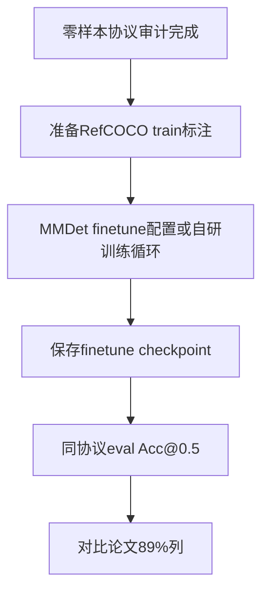

# RefCOCO 微调复现路线（论文微调列 81–89%）

> **与「最佳完成」零样本流水线分离**：本路线需监督训练，不在 `validate_all.py` 验收范围内。

## 目标指标（论文 Table 5，Swin-T + finetune）

| Split | 微调 @1 |
|-------|---------|
| RefCOCO val | 89.19 |
| RefCOCO testB | 85.89 |
| RefCOCO+ val | 81.22 |
| RefCOCO+ testB | 74.18 |
| RefCOCOg val | 86.94 |

当前零样本全量 semantic 约 **51–61%**，距上表约 **25–38 pp**。

## 前置条件

1. 零样本 OVD/VG 协议已审计（官方 script、CUDA 算子状态已记录）
2. 预训练权重：`weights/groundingdino_swint_ogc.pth`（O365+GoldG+Cap4M）
3. RefCOCO/+/g **训练集** 标注（非仅 val/testB parquet）

## 参考实现

| 来源 | 路径 / 说明 |
|------|-------------|
| MMDetection | [configs/grounding_dino](https://github.com/open-mmlab/mmdetection/tree/main/configs/grounding_dino) — `finetune` 与 `zeroshot_refcoco` 配置 |
| 论文 | Table 5 第三行：`O365,GoldG,RefC + finetune` |
| 官方仓库 | IDEA-Research/GroundingDINO 以推理/demo 为主，**无一键 RefCOCO 微调脚本** |

## 建议步骤

1. **数据**：COCO train2014 图像 + RefCOCO/+/g `refs(unc).p` / `instances.json`（或 MMDet 数据管线）
2. **训练**：冻结或部分解冻 backbone；lr / epoch 参考 MMDet `grounding_dino_swin-t_finetune_*`
3. **评测**：与零样本相同 Acc@0.5 口径，写入 `results/exp_<date>_finetune/`
4. **资源**：建议多卡 V100/A100，数天级；单 T4 16GB 仅适合小规模试验

## 与本仓库关系

| 目录 | 用途 |
|------|------|
| `results/exp_2026-05-23_*` | 零样本「最佳完成」产物，**勿覆盖** |
| `results/exp_<date>_finetune/` | 微调实验独立目录 |
| `configs/refcoco.yaml` | 推理配置；微调需新 yaml |

## 风险

- 训练数据与论文 GoldG/Cap4M 不完全一致时，微调列难以比特级复现
- 89% 为论文报告值，复现应记录 config + seed + checkpoint 以便审计
