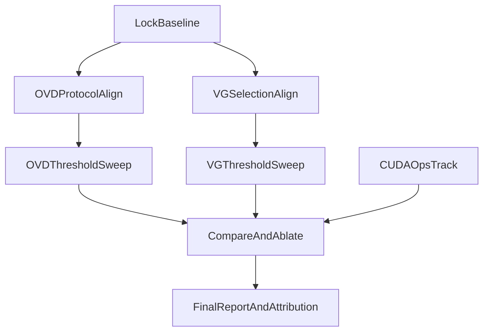

# Grounding DINO 高精度复现计划（OVD + VG）

> **运行环境**：Ubuntu 22.04 + NVIDIA V100（推荐 16GB 及以上显存）  
> **本仓库路径**：`$REPO`（克隆后 `export REPO=/path/to/cv-project`）  
> **目标**：在官方 `gdino` 后端上对齐评测协议，提升 OVD / VG 复现精度，并输出可审计的差距归因。

---

## 0. 云服务器快速上手（Ubuntu 22 + V100）

### 0.1 前置检查

```bash
# 驱动与 GPU
nvidia-smi

# 建议：CUDA 11.8 工具链（与 PyTorch cu118 轮子匹配）
nvcc --version   # 若无，见 0.2

# 磁盘：至少 80GB（COCO val + train2014 + 权重 + 结果）
df -h
```

### 0.2 推荐环境（conda）

```bash
# 系统依赖（编译 GroundingDINO CUDA 算子）
sudo apt update
sudo apt install -y build-essential git wget \
  gcc-11 g++-11 ninja-build

# Miniconda（若未安装）
# wget https://repo.anaconda.com/miniconda/Miniconda3-latest-Linux-x86_64.sh && bash ...

conda create -n cv python=3.10 -y
conda activate cv

cd $REPO
pip install "numpy<2.0"
pip install torch==2.1.2 torchvision==0.16.2 --index-url https://download.pytorch.org/whl/cu118
pip install -r requirements.txt
pip install transformers==4.47.1 pyarrow pandas

# GroundingDINO 源码安装（优先编译 CUDA 算子）
export CC=/usr/bin/gcc-11
export CXX=/usr/bin/g++-11
export CUDA_HOME=/usr/local/cuda   # 或 cuda-11.8 实际路径

cd third_party/GroundingDINO
python setup.py build develop
cd $REPO

python scripts/setup_env.py
```

**V100 说明**：

| 项目 | 建议 |
|------|------|
| 显存 | 16GB 足够 Swin-T OGC；32GB 可保持 `max_side: 800` 全量跑 |
| 长任务 | 使用 `tmux` / `screen`，避免 SSH 断开中断评测 |
| CUDA 算子 | 原生 Linux 上比 WSL 更容易编过；成功时日志**不再**出现 `Failed to load custom C++ ops` |
| 并行 | OVD 与 VG 可各占一张卡；单卡时顺序跑，避免 OOM |

### 0.3 数据与权重

将本地已准备好的目录同步到云端（`rsync` / 对象存储均可）：

```text
data/coco/val2017/
data/coco/train2014/          # VG 必需
data/coco/annotations/instances_val2017.json
data/refcoco_hf/              # refcoco / refcoco+ / refcocog 的 parquet
weights/groundingdino_swint_ogc.pth
configs/GroundingDINO_SwinT_OGC.py
```

```bash
cd $REPO
python scripts/download_weights.py   # 若权重未上传
```

### 0.4 配置确认（云端默认）

- `configs/coco_ovd.yaml`：`backend: gdino`，`prompt.mode: concat_token`
- `configs/refcoco.yaml`：`backend: gdino`，`inference.selection: semantic`

---

## 1. 目标与已知基线

在 **WSL / RTX 4060** 上已得到的参考值（云端应复现或更好）：

| 实验 | 指标 | 说明 |
|------|------|------|
| 基线 OVD（短语匹配 + 坐标修复前） | mAP **42.4** | `results/exp_2026-05-23_baseline/` |
| OVD 协议对齐（concat_token，1k 子集） | mAP **~46.3** | 待全量 5k 验证 |
| 基线 VG（argmax 选框） | Acc@0.5 **50–60%** | 各 split 见 baseline metrics |
| VG 语义选框（100 样本 smoke） | Acc@0.5 **~54%** | 待全量 `--all` |
| 论文参考 | OVD **48.4**；VG **~81–89%** | 仍有协议/算子/数据差距 |

重点不是盲目刷分，而是 **与官方流程对齐 + 可复现实验闭环**。

---

## 2. 阶段 1：锁定可复现基线与实验开关（约半天）

### 2.1 冻结当前基线

```bash
mkdir -p results/exp_$(date +%F)_baseline
cp configs/coco_ovd.yaml configs/refcoco.yaml results/exp_*_baseline/ 2>/dev/null || true
cp results/coco_gdino/metrics.json results/refcoco_gdino/metrics.json \
   results/exp_$(date +%F)_baseline/ 2>/dev/null || true
```

在 `reports/report.md` 保留一列「当前基线」，避免后续回归无参照。

### 2.2 实验矩阵与命名规范

每次实验写入独立目录，例如：

```text
results/exp_2026-05-23_ovd_aligned/
results/exp_2026-05-23_ovd_sweep/
results/exp_2026-05-23_vg_aligned/
results/exp_2026-05-23_cuda_ops/
```

`experiment_manifest.json` 至少记录：

- `backend`（gdino / hf）
- `resize`（短边 800，长边 ≤1333）
- `box_threshold` / `text_threshold`
- `postprocess`（concat_token / concat / semantic）
- `cuda_custom_ops`（true / false）

---

## 3. 阶段 2：OVD 对齐官方评测协议（半天～1 天）

### 3.1 对齐前处理与后处理

对照官方脚本核对：

- 参考：`third_party/GroundingDINO/demo/test_ap_on_coco.py`
- 实现：`src/ovd/official_postprocess.py`、`src/ovd/eval_coco.py`（`prompt.mode: concat_token`）
- 模型：`src/model_wrapper.py`（gdino resize + 原图坐标回映射）

检查项：

1. 图像 resize：短边 800，长边 ≤ 1333  
2. 类别文本：`build_captions_and_token_span` + `create_positive_map_from_span`  
3. 类别映射：token-level `positive_map`，避免 `phrase → catid` 字符串匹配损耗  

### 3.2 阈值网格扫描（OVD）

```bash
cd $REPO
conda activate cv

# 子集 1000 扫描（约 9 组 × ~10min/组，V100 通常更快）
python scripts/sweep_ovd_thresholds.py

# 查看最佳组合
cat results/exp_2026-05-23_ovd_sweep/best_subset.json
```

网格：

- `box_threshold`：0.15 / 0.20 / 0.25  
- `text_threshold`：0.05 / 0.10 / 0.20  

### 3.3 全量 OVD（5000 张）

```bash
python scripts/run_ovd_best_full.py
# 或手动指定阈值：
python src/ovd/eval_coco.py --config configs/coco_ovd.yaml
```

**验收**：

- 子集 mAP 稳定高于基线子集  
- 全量 mAP **> 42.4**，目标 **45+**，尽量逼近 **48.4**

---

## 4. 阶段 3：VG 语义对齐选框（约 1 天）

### 4.1 选框策略

- 旧：`argmax(score)`（`inference.selection: argmax`）  
- 新：**token 对齐分数优先**（`inference.selection: semantic`）  
- 实现：`src/vg/box_selection.py`、`scripts/run_vg_eval.py`

### 4.2 阈值扫描 + 全量

```bash
# 子集扫描（refcoco validation，500 条/组）
python scripts/sweep_vg_thresholds.py

# 将 best_subset.json 中的阈值写入 configs/refcoco.yaml 后全量：
tmux new -s vg
python scripts/run_vg_eval.py --all --hf-dir data/refcoco_hf
# Ctrl+B D 脱离；tmux attach -t vg 查看进度
```

网格：

- `box_threshold`：0.05 / 0.10 / 0.20  
- `text_threshold`：0.05 / 0.10 / 0.20  
- 可选 `top_k`：5 / 10  

**验收**：RefCOCO / RefCOCO+ / RefCOCOg 各 validation（及 testB）较基线有可解释提升。

---

## 5. 阶段 4：CUDA 自定义算子（并行，约半天）

**云服务器上优先做**：V100 + Ubuntu 22 通常比 WSL 更容易编过 `groundingdino._C`。

```bash
export CC=/usr/bin/gcc-11
export CXX=/usr/bin/g++-11
export CUDA_HOME=/usr/local/cuda

python scripts/try_cuda_ops.py
cat results/exp_2026-05-23_cuda_ops/status.json
```

成功标准：

- `import groundingdino._C` 无报错  
- 推理日志**无** `Using PyTorch fallback for deformable attention`  
- 在**独立目录**重跑 OVD/VG 子集，与 PyTorch fallback 对比  

失败时：记录 `build_attempt.log`，不阻塞主线；报告中注明「算子未启用」。

---

## 6. 阶段 5：误差分析与最终归因（约半天）

### 6.1 实验矩阵 → 指标

更新 `reports/report.md`，至少包含：

| 标签 | OVD mAP | VG Acc@0.5 | 备注 |
|------|---------|------------|------|
| Baseline | 42.4 | 50–60% | phrase 匹配 / argmax |
| OVD 对齐 | TBD | — | concat_token + sweep 最佳阈值 |
| VG 对齐 | — | TBD | semantic + sweep 最佳阈值 |
| CUDA 算子（可选） | TBD | TBD | 仅 status=available 时填写 |

### 6.2 失败案例分桶

- **OVD**：小目标、密集场景、类别歧义  
- **VG**：语义错配、多实例歧义、长文本表达  

### 6.3 归因结论（模板）

1. 已通过协议对齐消除的差距（坐标、token map、选框策略）  
2. 仍可能来自模型/预训练/CUDA 算子的差距  
3. 下一步优先项：全量阈值、CUDA 算子、官方 demo 逐行 diff  

---

## 7. 执行顺序



---

## 8. 关键文件清单

| 用途 | 路径 |
|------|------|
| OVD 评测 | `src/ovd/eval_coco.py` |
| OVD 官方后处理 | `src/ovd/official_postprocess.py` |
| 模型封装 | `src/model_wrapper.py` |
| VG 评测 | `scripts/run_vg_eval.py` |
| VG 选框 | `src/vg/box_selection.py` |
| OVD 阈值扫描 | `scripts/sweep_ovd_thresholds.py` |
| VG 阈值扫描 | `scripts/sweep_vg_thresholds.py` |
| OVD 全量（最佳阈值） | `scripts/run_ovd_best_full.py` |
| CUDA 算子尝试 | `scripts/try_cuda_ops.py` |
| 官方参考 | `third_party/GroundingDINO/demo/test_ap_on_coco.py` |
| 报告 | `reports/report.md` |

---

## 9. 任务清单（与计划 Todo 对应）

- [x] 冻结 OVD/VG 基线配置与结果快照  
- [x] 对齐 OVD 官方前后处理（`concat_token`）  
- [x] OVD 阈值扫描 + 全量 5k（`sweep_ovd_thresholds.py` → `run_ovd_best_full.py`）  
- [x] VG 语义对齐选框（`selection: semantic`）  
- [x] VG 阈值扫描 + 全量 `--all`  
- [x] CUDA 算子编译与对比（云服务器重点；`fallback_pytorch` 已记录）  
- [x] 更新 `reports/report.md` 实验矩阵与归因  

---

## 10. 成功标准（1～2 天窗口）

- OVD 全量 mAP **明确高于 42.4**，流程可复现  
- VG 各验证集较基线再提升，消融可说明来自选框/协议对齐  
- 报告中有清晰、可审计的「差距归因链路」  

---

## 11. 给 Cursor / Agent 的提示（云服务器）

复制到对话开头即可：

```text
环境：Ubuntu 22.04，单卡 NVIDIA V100，conda 环境名 cv，仓库根目录 $REPO。
请严格按 docs/高精度复现计划_OVD_VG.md 执行，不要修改该计划文档本身。
后端必须用 gdino（configs 已设 backend: gdino），OVD 用 prompt.mode=concat_token，
VG 用 inference.selection=semantic。
长任务用 tmux；结果写到 results/exp_<date>_<tag>/，勿覆盖 baseline。
优先完成：OVD sweep → 全量；VG sweep → run_vg_eval.py --all；try_cuda_ops.py；
最后更新 reports/report.md 实验矩阵与归因。
```

---

## 12. 结果回传（本地归档）

```bash
# 在云端打包
tar czf results_cloud_$(date +%F).tar.gz results/exp_* reports/report.md

# 拉回本地
rsync -avz user@cloud:/path/to/cv-project/results/exp_* ./results/
```
